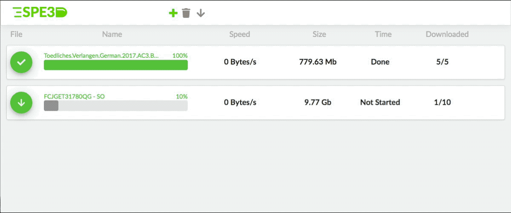

# 
[](https://travis-ci.org/Roba1993/SPE3D)
[](https://microbadger.com/images/roba1993/spe3d "Get your own image badge on microbadger.com")

### Fast and Easy Download Manager for Servers - [Download the Docker Image!](https://hub.docker.com/r/roba1993/spe3d/)



## Description
The SPE3D download manager allows to easy download of files on your server or system where you have the docker container and his folders mounted to. To manage the downloads easily, a webbased HTML 5 frontend is provided.

The backend is written with the programming language Rust, which provides great performance and security at the same time. This language is developed and maintained by Mozilla and ust in Firefox, VLC, etc.

The frontend is written in React, a fast and easy webframework provided by facebook.

## Installation
Here a short ovweview how to use the download manager:

1. Download the docker container [here](https://hub.docker.com/r/roba1993/spe3d/)
2. Publish the ports `8000` and `8001` (Sorry this fixed right now)
2. Mount the folders `/config` & `/out`
4. Start SPE3D

## Complile it yourself
To compile SPE3D youself, you have a lot of different solutions, for different use-cases.

The easiest and fastes solution is to use make to build the frontend and backend automatically for you, with the following command inside the project folder.

```bash
make 
```
Now you just need to start the newly created `spe3d` binary in the `/target` folder.

To compile the docker container, just call the following command.
```bash
make docker
```

There are predifined commands to stat and remove a docker container fast and easily, witht the pre-defined bindings.
```bash
make docker-run
make docker-rm
```

## Development
Please feel always free to participate to this project with improvements or extensions.
I highly welcome any work which is comming from existing or complete new developers.
Again feel free to fork this repo and push changes back.

For the frontend development, just navigate into the `/react` folder and call the following command.
```bash
npm install
npm start
```
The first command install all the frontend dependencies and the second one starts a frontend development server, which puashes all changes directly into your browser.


For the backend development, just compile the programm with rust in the main project folder, as follow.
```bash
cargo run
```


## Actual development milestones:
- [ ] First official release
- [ ] Logging
- [ ] Support YouTube downloads
- [ ] Support general file downloads
- [X] Delivered as small 10mb docker container
- [X] Automatic travis test and build with upload to github
- [X] New UI design
- [X] Split backend to library and binary
- [X] Support Premium Share-Online downloads

