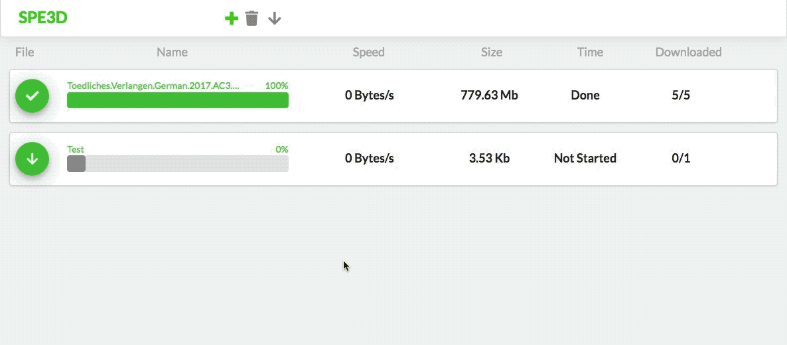

# SPE3D

### Fast and Easy Download Manager for Servers - [Download Docker the Image!](https://hub.docker.com/r/roba1993/spe3d/)

## Description
The SPE3D download manager allows to easy download of files on your server or system where you have the docker container folder mounted to. To manage the downloads easily a webbased HTML 5 frontend is provided.

The backend is written with the programming language Rust, which provides great performance and security at the same time. This language is developed and maintained by Mozilla and ust in Firefox, VLC, etc.

The frontend is written in React, a fast and easy webframework provided by facebook.

## Installation
Here a short ovweview how to use the download manager:

1. Download the docker container [here](https://hub.docker.com/r/roba1993/spe3d/)
2. Publish the ports 8000 and 8001 (Sorry this fixed right now)
2. Mount the folders `/config` & `out`
4. Start SPE3D

## Actual development milestones:
- [X] Support Premium Share-Online downloads
- [ ] Support YouTube downloads
- [ ] Support general file downloads
- [X] Delivered as small 10mb docker container
- [X] Automatic travis test and build with upload to github
- [X] New UI design
- [X] Split backend to library and binary
- [ ] First official release
- [ ] Logging
